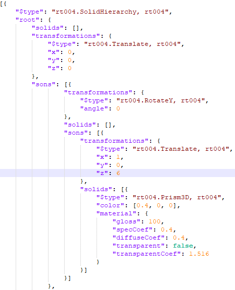

# What is Render#

Render# is a photorealistic renderer built using C#. It supports refractive ,reflective surfaces and anti-aliasing. 

## Features
- Json compatible
- Supports solid hierarchical scheme
- HDR output

## Usage
The program reads from 3 main config/json files. These are required for the program to run.
### SolidsConfig:
* The scene's objects as well as their materials, represented in a tree structure.
* Each node must contain:
  + Transformation matrix
  + Types of solids on the node
* There are currently 6 supported transformations:  
  + Translate (x, y, z)
  + Rotate x/y/z (in degrees x/y/z)
  + Resize (x, y, z)
  + Shear (xy, xz, yz, yx, zx, zy)
* There are currently 5 supported solids (3 primitive, 2 complex)
  + Primitive: Triangle3D, Sphere3D, Plane3D
  + Complex: Square3D, Prism3D

### LightsConfig:
* All the lights for the current scene

### CameraConfig:
* Position of the camera
* Target vector (direction of camera)
* Upguide vector (what is "up" for camera)
* Resolution and FOV for the camera

## Output
We support multiple cameras, each camera generates one output image.
The output images are stored in the /Output directory.

## Download
The dependencies should be installed automatically during the first run of the software. In case that it doesn't happen here are the NuGet packages for Visual Studio.
### Dependencies:
-  Newtonsoft.Json v. 13.0
-  OpenTK 4.7

