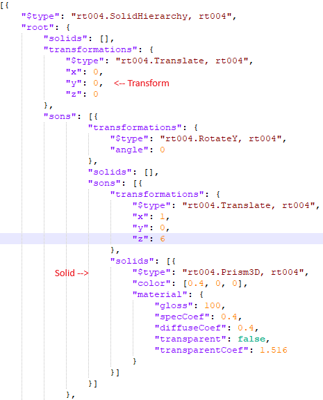

# What is Render#

Render# is photorealistic renderer built using C#. Its supports refractive and reflective surfaces, anti-aliasing. 

## Features
- Json compatible
- Supports solid hierachical scheme
- HDR output

## Usage
The program reads from 3 main config/json files. These are requiered for the run of the program.
The SolidsConfig contains:
- The scenes objects as well as their materials, represented in tree structure.
- Each node has to contain:
  - Transformation matrix
  - Types of solids on the node

## Download
### Dependencies:
-  Newtonsoft.Json v. 13.0
-  OpenTK 4.7

